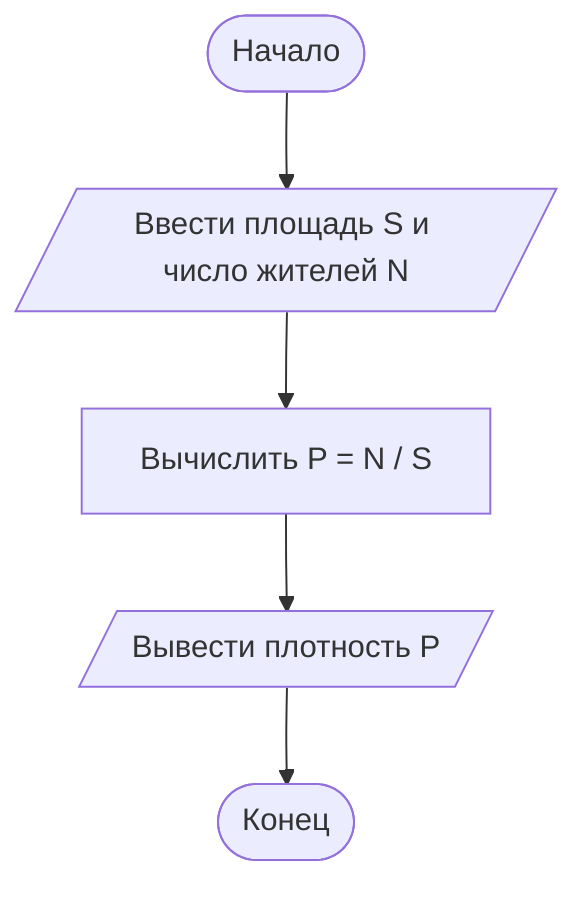

# Домашнее задание — практика 3, вариант 27

> Найти плотность населения по заданной площади территории и числу жителей.

## Данные и расчёт

- **S** — площадь территории в выбранных квадратных единицах.
- **N** — число жителей.
- **P** — плотность населения.

```text
P = N / S
```

Площадь должна быть больше нуля. Ответ выражается в жителях на ту же единицу площади. Например, если площадь задана в км², результат будет в жителях на км².

## Блок-схема



## Пример

Площадь — **50 км²**, число жителей — **10000**.

```text
P = 10000 / 50 = 200 жителей на км²
```

## Запуск

В программе дойди до приглашения домашнего задания, введи сначала площадь, затем число жителей. Для примера введи **50 10000**. В Visual Studio запуск — **Ctrl+F5**.

[Методичка к практике 3](https://sites.google.com/view/course-of-study1-c/практика/работа-3)